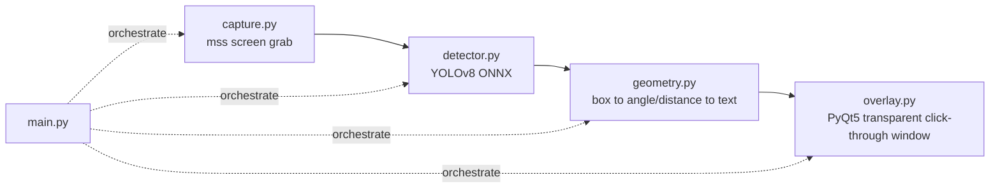

# game-target-hud — Thiết kế đầy đủ

## 0. Phạm vi & giả định đã chốt

- Single-player / học thuật only, không multiplayer.
- Bắt đầu từ Level 1 (detection → text) để có demo chạy sớm.
- Output: overlay real-time trên màn hình lúc chơi, yêu cầu latency thấp.

## 1. Kiến trúc tổng

5 module, mỗi module 1 trách nhiệm rõ ràng, ghép qua `main.py`. Thiết kế này cố ý tách rời để Level 2/3 chỉ cần đổi 1-2 module, không đụng phần còn lại.

## 2. Module breakdown

### 2.1 `capture.py`
- Dùng `mss` thay vì `pyautogui.screenshot` — nhanh hơn đáng kể, quan trọng cho real-time.
- Hỗ trợ giới hạn `region` (không bắt buộc chụp toàn màn hình) — dùng để giảm chi phí capture khi chỉ cần vùng chơi chính, bỏ qua HUD game không cần detect.
- Output: numpy array BGR, khớp thẳng format OpenCV/Detector, không cần convert thêm.

### 2.2 `detector.py`
- YOLOv8n ONNX qua `onnxruntime` (CPU provider) — không cần PyTorch runtime, nhẹ hơn khi deploy.
- Tự letterbox resize (giữ tỷ lệ khung hình, pad viền 114/114/114 theo chuẩn YOLO) rồi map bounding box ngược lại toạ độ gốc — quan trọng vì màn hình game thường không vuông 640x640 như input model.
- `class_filter` param: Level 1 lọc class 0 (person) làm proxy test tạm; Level 2 chỉ cần đổi model + list class, interface `detect()` giữ nguyên.
- NMS dùng `cv2.dnn.NMSBoxes` — tránh 2 box chồng nhau lên cùng 1 mục tiêu.

### 2.3 `geometry.py`
- Thuần logic toán học, không phụ thuộc model/display → test độc lập được bằng unit test, không cần game/màn hình thật.
- Góc tính theo quy ước la bàn game bắn súng (0° = phía trước/12 giờ), chia 8 hướng (trước, trước-phải, phải, sau-phải, sau, sau-trái, trái, trước-trái).
- Khoảng cách ước lượng bằng tỷ lệ diện tích box/frame — proxy thô (không phải depth thật), hệ số hiệu chỉnh (`* 12.0`) cần tune lại theo game thực tế lúc test.

### 2.4 `overlay.py`
- PyQt5 window: `FramelessWindowHint | WindowStaysOnTopHint | Tool` + `WA_TranslucentBackground` + `WA_TransparentForMouseEvents` (click-through, không chặn input tới game).
- `paintEvent` vẽ box viền đỏ + label nền đen mờ, dùng `QPainter` — nhẹ, không cần asset ảnh.
- Giới hạn đã biết: không hiện được trên game fullscreen exclusive (chỉ Borderless Windowed) — giới hạn chung của window-layering overlay, không riêng code này.

### 2.5 `main.py`
- Vòng lặp qua `QTimer` (không dùng `while True` thô để không block Qt event loop).
- `--fps-limit` giới hạn tần suất xử lý — tránh ăn hết CPU/GPU của game đang chạy song song.
- In latency mỗi frame ra console — số liệu đầu tiên cần nhìn khi test thật, quyết định có cần tối ưu (giảm vùng capture, model nhỏ hơn, giảm fps) hay không.

## 3. Trạng thái test (đã verify thật, không chỉ viết code suông)

| Module | Cách test | Kết quả |
|---|---|---|
| `detector.py` | Inference thật trên ảnh mẫu `bus.jpg` | Đúng 4 person + 1 bus, conf 0.44–0.89 |
| `geometry.py` | 4 unit test các vị trí box khác nhau | Pass hết |
| `overlay.py` | Smoke test offscreen (`QT_QPA_PLATFORM=offscreen`) | Không crash, paint chạy được |
| `capture.py` | Chỉ verify import + logic crop | Chưa test — sandbox không có display |
| `main.py` full loop | — | Chưa chạy E2E — cần máy thật |

## 4. Level 2 — Detect "tank địch" (custom class)

- **Data collection**: capture frame từ chính game bạn chơi (single-player/campaign/replay), đa dạng góc/khoảng cách/ánh sáng.
- **Labeling**: CVAT/Roboflow/LabelImg, vẽ box quanh tank.
- **Train**: transfer learning trên `yolov8n.pt` (freeze backbone nếu dataset nhỏ) → export ONNX bằng đúng script đã dùng cho Level 1 (`model.export(format='onnx')`).
- **Đổi trong code**: swap `models/yolov8n.onnx`, đổi `COCO_CLASSES` trong `detector.py` thành class list riêng (vd `["tank_enemy", "tank_ally"]`), đổi `--target-classes`. Không đụng `geometry.py`, `overlay.py`, `main.py`.
- **Phân biệt địch/quân mình**: ưu tiên 2 class riêng nếu khác biệt trực quan (màu/phù hiệu) đủ rõ để model học; tránh dựa vào team-ID từ HUD game (lệch sang đọc dữ liệu nội bộ, không còn thuần CV).
- **Đánh giá**: mAP theo từng class, không chỉ accuracy tổng.

## 5. Level 3 — Detect núp sau bụi cây (occlusion-robust)

Sub-field riêng (amodal/partial-occlusion detection), cần thiết kế thêm ngoài rule detect thông thường:

- **Data augmentation** (làm trước, ROI cao nhất): lấy ảnh tank rõ từ dataset Level 2, overlay tự động mảng lá/bụi che 30-70% diện tích, giữ nguyên bounding box gốc làm ground truth.
- **Temporal tracking** (bổ sung): thêm tracker (DeepSORT/ByteTrack) giữa `detector.detect()` và `geometry` trong `main.py` — khi tank khuất sau bụi, track giữ vị trí/velocity dự đoán thay vì mất dấu ngay.
- **Đánh giá riêng**: test set chia theo % diện tích bị che (0-25/25-50/50-75%) → đo recall giảm theo mức che, chart này đáng show nhất trong portfolio.

## 6. Việc cần làm tiếp (theo thứ tự)

1. Chạy `main.py --target-classes 0` trên máy thật, ghi lại latency console.
2. Nếu latency ổn (mục tiêu tham khảo: dưới ~100ms/frame cho cảm giác real-time) → bắt đầu thu thập dataset Level 2.
3. Nếu latency không ổn → tối ưu trước khi train thêm gì: thử giới hạn `region` capture, giảm `--fps-limit`, hoặc quantize model.
